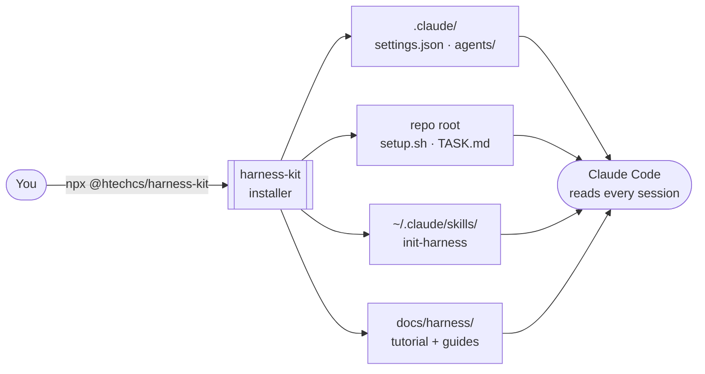
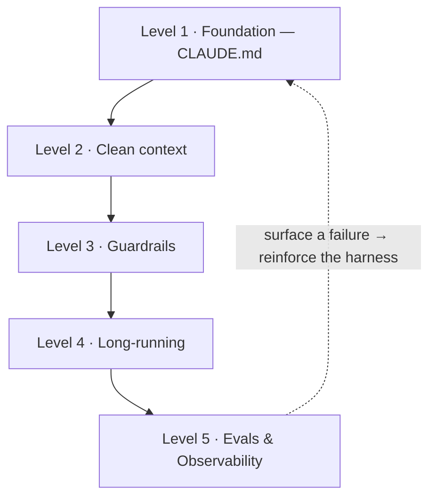

<div align="center">

# harness-kit

**Set up any repo for a coding agent (Claude Code) across the 5 maturity levels of harness engineering — in one command.**

[](https://www.npmjs.com/package/@htechcs/harness-kit)
[](LICENSE)


[Tiếng Việt](README.md) · **English**

<br>


</div>

---

**Harness** = everything *around* the model (context, instructions, tools, safety constraints,
orchestration, measurement) that makes an agent reliable. This kit packages it into installable
**artifacts** plus a **tutorial** that teaches *when* to use each. The kit ships files; the tutorial
teaches the discipline.

## 1. How it works



One `npx` command drops artifacts in the right places; from there Claude Code reads them every session.

## 2. Quick install

```bash
npx @htechcs/harness-kit              # pick levels interactively, then install
npx @htechcs/harness-kit --all        # install all 5 levels
npx @htechcs/harness-kit --levels=1,3 # specific levels only
```

Requires **Node ≥18**. The command saves all docs into `docs/harness/` so your team keeps them.
**Idempotent** — safe to re-run (`--force` to overwrite).

## 3. The 5 levels — each prevents a failure mode



| Level | Without it | Artifact |
|-------|------------|----------|
| **1 — Foundation** | the agent has no durable repo guidance | `/init-harness` skill → generates `CLAUDE.md` |
| **2 — Clean context** | context floods, the agent's attention dilutes | sample subagent + MCP audit checklist |
| **3 — Guardrails** | agent deletes/pushes by mistake, asks permission nonstop | `settings.json` (deny/ask/allow) |
| **4 — Long-running** | long tasks break mid-way, can't resume | `setup.sh`, `new-worktree.sh`, `TASK.md` |
| **5 — Evals & Obs** | no idea whether the agent does well or badly | golden-task template + observability guide |

## 4. Manual install per level

> The installer just automates the `cp` commands below — expand them to understand/do it by hand.

<details>
<summary><b>Level 1 — Foundation · CLAUDE.md</b> &nbsp;<code>[do this first]</code></summary>

```bash
cp -r skills/init-harness ~/.claude/skills/   # then run /init-harness in the target repo
```
</details>

<details>
<summary><b>Level 2 — Clean context</b></summary>

```bash
mkdir -p .claude/agents && cp templates/agents/repo-explorer.md .claude/agents/
```
Read `templates/agents/README.md` + `templates/mcp-audit.md`.
</details>

<details>
<summary><b>Level 3 — Guardrails</b> &nbsp;<code>[points into CLAUDE.md]</code></summary>

```bash
mkdir -p .claude && cp templates/settings.json .claude/settings.json
```
**First thing to do:** add your repo's test/lint commands to `allow` (see `templates/guardrails/README.md`).
</details>

<details>
<summary><b>Level 4 — Long-running</b> &nbsp;<code>[points into CLAUDE.md]</code></summary>

```bash
cp templates/setup.sh templates/new-worktree.sh . && chmod +x setup.sh new-worktree.sh
cp templates/long-running/TASK.md .            # when starting a long task
```
</details>

<details>
<summary><b>Level 5 — Evals & Observability</b> &nbsp;<code>[needs ≥1 level applied to have something to measure]</code></summary>

```bash
mkdir -p evals/cases && cp templates/evals/cases/example-task.md evals/cases/
```
Read `templates/evals/README.md` (includes a **no-harness baseline** step) + `observability.md`.
</details>

<details>
<summary><b>+ Specs</b> — the other half of Pillar 2</summary>

```bash
mkdir -p docs/specs && cp templates/spec/FEATURE.md docs/specs/<feature>.md
```
</details>

## 5. Level dependencies

- **Level 1 first** — it's the backbone; later levels reference `CLAUDE.md`.
- **Levels 3 & 4** both "point `CLAUDE.md` to" their artifacts → require Level 1 done.
- **Level 5** needs at least one level applied to have a change to measure (see the feedback loop above).

## 6. Docs

`docs/harness-engineering-tutorial.en.md` ([Tiếng Việt](docs/harness-engineering-tutorial.md)) — the
why + *when* to use each piece (after install: `docs/harness/`). Full industry-wide source catalog:
[Awesome Harness Engineering](https://github.com/walkinglabs/awesome-harness-engineering).

## 7. License

[MIT](LICENSE).
