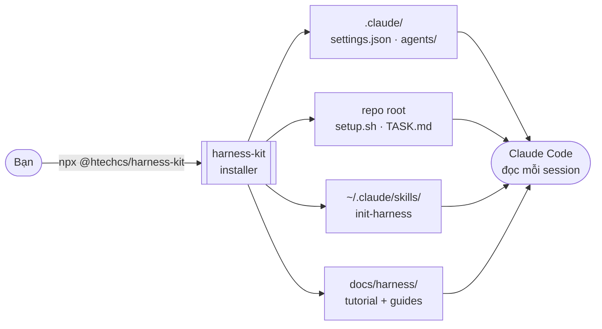
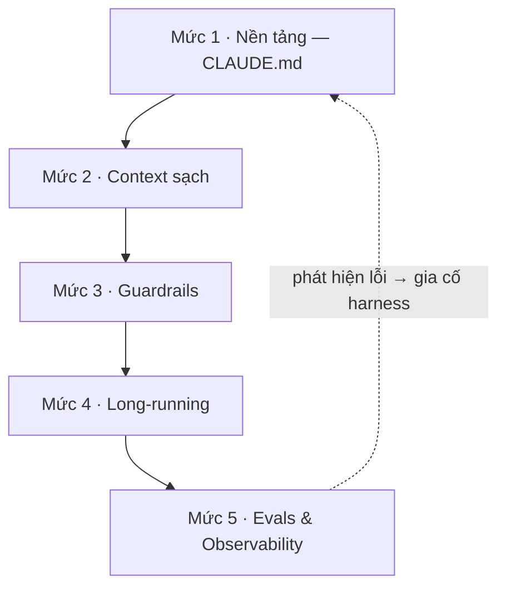

<div align="center">

# harness-kit

**Thiết lập repo cho coding agent (Claude Code) theo 5 mức trưởng thành của harness engineering — bằng một lệnh.**

[](https://www.npmjs.com/package/@htechcs/harness-kit)
[](LICENSE)


**Vietnamese** · [English](README.md)

<br>


</div>

---

**Harness** = mọi thứ *bao quanh* model (context, chỉ dẫn, tools, ràng buộc an toàn, orchestration,
đo lường) để agent làm việc đáng tin. Kit này đóng gói nó thành **artifact** cài được + một
**tutorial** dạy *khi nào* dùng từng thứ. Kit ship file; tutorial dạy kỷ luật.

## 1. Hoạt động thế nào



Một lệnh `npx` rải artifact vào đúng chỗ; từ đó Claude Code đọc chúng ở mọi phiên làm việc.

## 2. Cài nhanh

```bash
npx @htechcs/harness-kit              # hỏi chọn mức rồi cài
npx @htechcs/harness-kit --all        # cài cả 5 mức
npx @htechcs/harness-kit --levels=1,3 # chỉ mức cụ thể
```

Cần **Node ≥18**. Lệnh lưu toàn bộ tài liệu vào `docs/harness/` để team giữ lại. **Idempotent** —
chạy lại an toàn (`--force` để ghi đè).

## 3. 5 mức — mỗi mức chặn một kiểu thất bại



| Mức | Khi không có nó | Artifact |
|-----|-----------------|----------|
| **1 — Nền tảng** | agent không có chỉ dẫn repo bền vững | skill `/init-harness` → sinh `CLAUDE.md` |
| **2 — Context sạch** | context ngập, agent "loãng" sự chú ý | subagent mẫu + checklist rà MCP |
| **3 — Guardrails** | agent xoá/push nhầm, bị hỏi quyền liên tục | `settings.json` (deny/ask/allow) |
| **4 — Long-running** | việc dài đứt giữa chừng, không resume | `setup.sh`, `new-worktree.sh`, `TASK.md` |
| **5 — Evals & Obs** | không biết agent làm tốt hay tệ | golden-task template + guide observability |

## 4. Cài tay từng mức

> Installer chỉ tự động hoá đúng những lệnh `cp` dưới đây — mở ra nếu muốn hiểu/làm thủ công.

<details>
<summary><b>Mức 1 — Nền tảng · CLAUDE.md</b> &nbsp;<code>[làm trước tiên]</code></summary>

```bash
cp -r skills/init-harness ~/.claude/skills/   # rồi gõ /init-harness trong repo đích
```
</details>

<details>
<summary><b>Mức 2 — Context sạch</b></summary>

```bash
mkdir -p .claude/agents && cp templates/agents/repo-explorer.md .claude/agents/
```
Đọc `templates/agents/README.md` + `templates/mcp-audit.md`.
</details>

<details>
<summary><b>Mức 3 — Guardrails</b> &nbsp;<code>[trỏ vào CLAUDE.md]</code></summary>

```bash
mkdir -p .claude && cp templates/settings.json .claude/settings.json
```
**Việc đầu tiên:** thêm lệnh test/lint của repo vào `allow` (xem `templates/guardrails/README.md`).
</details>

<details>
<summary><b>Mức 4 — Long-running</b> &nbsp;<code>[trỏ vào CLAUDE.md]</code></summary>

```bash
cp templates/setup.sh templates/new-worktree.sh . && chmod +x setup.sh new-worktree.sh
cp templates/long-running/TASK.md .            # khi bắt đầu một việc dài
```
</details>

<details>
<summary><b>Mức 5 — Evals & Observability</b> &nbsp;<code>[cần ≥1 mức đã áp để có cái mà đo]</code></summary>

```bash
mkdir -p evals/cases && cp templates/evals/cases/example-task.md evals/cases/
```
Đọc `templates/evals/README.md` (có bước **baseline không-harness**) + `observability.md`.
</details>

<details>
<summary><b>+ Specs</b> — nửa còn lại của Trụ cột 2</summary>

```bash
mkdir -p docs/specs && cp templates/spec/FEATURE.md docs/specs/<feature>.md
```
</details>

## 5. Phụ thuộc giữa các mức

- **Mức 1 trước hết** — xương sống; các mức sau viện tới `CLAUDE.md`.
- **Mức 3 & 4** đều "trỏ `CLAUDE.md` tới" artifact của chúng → cần Mức 1 xong.
- **Mức 5** cần ít nhất một mức đã áp để có thay đổi mà đo (xem vòng feedback ở sơ đồ trên).

## 6. Tài liệu

`docs/harness-engineering-tutorial.md` ([English](docs/harness-engineering-tutorial.en.md)) — vì sao +
*khi nào* dùng từng thứ (sau khi cài: `docs/harness/`). Danh mục nguồn đầy đủ của cả ngành:
[Awesome Harness Engineering](https://github.com/walkinglabs/awesome-harness-engineering).

## 7. License

[MIT](LICENSE).
